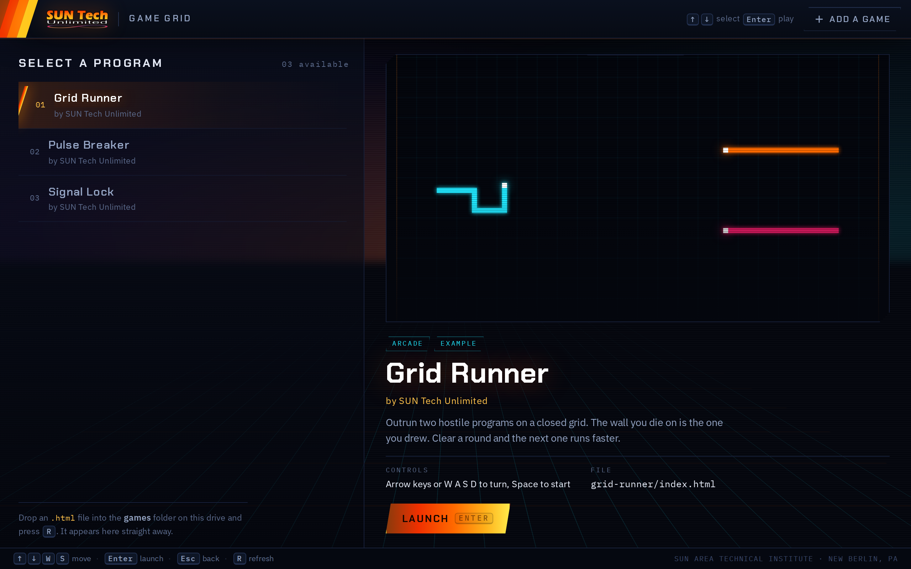

# SUN Tech Unlimited — USB Game Loader

A self-contained, branded arcade shelf that runs from a USB stick. Students drop the browser games they've written into a folder; the stick finds them, presents them properly, and plays them.

Windows and macOS. No installation, no internet, no administrator rights.



---

## Why this exists

Kids learning to build with AI can get a working browser game out of a chat session surprisingly fast. What they usually can't do is *show it to anyone*. The game ends up as a lone `.html` file in a Downloads folder — no title, no cover, no way to hand it to a friend, and nothing that makes the afternoon feel like it produced something real.

This is the harness that closes that gap. It gives a camp, club, or one-day activity a finished-feeling shell to load student work into, so that at the end of the session every kid walks out with a **branded USB stick they can plug into any computer** and play what they made — alongside what everyone else made.

The technical work here is deliberately invisible. The point is the moment a fourteen-year-old hands the stick to a parent and says *"the third one is mine."*

Built pro bono for [SUN Tech Unlimited](https://unlimited.sun-tech.org/), the technology club at [SUN Area Technical Institute](https://sun-tech.org/) in New Berlin, Pennsylvania.

---

## What it does

- **Finds games automatically.** Any `.html` file in `games/` shows up, listed or not. Nothing a student adds can vanish.
- **Presents them well.** Title, author credit, description, cover art, and controls — from a single `games.json` manifest.
- **Plays them in place.** Games run in a frame under a thin, persistent club ribbon. <kbd>Esc</kbd> always returns to the menu, even mid-game.
- **Keyboard first.** Arrows or <kbd>W</kbd>/<kbd>S</kbd> to move, <kbd>Enter</kbd> to launch. It should feel like a console, not a file browser.
- **Takes new games without editing JSON.** A built-in *Add a game* form writes the manifest entry so a stray comma can't take the whole menu down.
- **Runs offline.** Fonts are self-hosted. Nothing is fetched from a CDN, because school networks block them.

---

## Quick start

Copy the contents of [`USB-Drive/`](USB-Drive) onto a USB stick — the files go at the **root** of the drive, not inside a subfolder.

### Windows

Double-click **`START.bat`**.

A console window opens and stays open (closing it shuts the loader down), and the arcade appears in a clean, chrome-less browser window.

> **USB autorun does not work on modern Windows.** Microsoft disabled AutoRun for removable drives in 2011; it survives only on CD/DVD-class devices. There's an `autorun.inf` on the drive as a best effort and to give the stick a proper name and icon in File Explorer, but a human has to double-click `START.bat`. Plan your activity around that.

### macOS

Double-click **`START.command`**.

**On recent macOS this will not work the first time, and right-clicking will not help.** See the next section — it takes about ten seconds to clear.

### Security warning on macOS

macOS tags anything that arrives from the internet or an unfamiliar drive with a *quarantine* attribute, and Gatekeeper refuses to run a script carrying that tag until a human vouches for it. You'll see:

> *"START.command" cannot be opened because it is from an unidentified developer.*

Nothing is wrong with the file. **As of macOS Sequoia (15), Apple removed the old Control-click → Open shortcut** that used to clear this, so on any current Mac that trick does nothing at all. Two things do work:

**Clear the tag from Terminal — recommended, and the only sane option for preparing sticks in bulk.** Open Terminal (⌘-Space, type "Terminal") and run:

```bash
xattr -dr com.apple.quarantine /Volumes/YOUR-DRIVE-NAME
chmod +x /Volumes/YOUR-DRIVE-NAME/START.command
```

Replace `YOUR-DRIVE-NAME` with the stick's actual name — run `ls /Volumes` to see it. The first line removes the quarantine tag from every file on the drive; the second restores the executable bit, which FAT and exFAT drives don't preserve. Then double-click `START.command` as normal.

**Or approve it once through System Settings.** Double-click `START.command` and let it be refused. Then open **System Settings → Privacy & Security**, scroll to the Security section, and click **Open Anyway** next to the message about `START.command`. Confirm with Touch ID or your password. This approves that one file on that one Mac, so you'll repeat it on every machine — which is why the Terminal command above is better if more than one Mac is involved.

> **Doing this for a camp or club?** Clear the quarantine tag on the master stick *before* you clone copies. It saves you doing it on every machine, in front of a room of kids waiting to play.

### Making it faster and more reliable

Run **`SETUP-RUNTIME.bat`** (Windows) or **`setup-runtime.command`** (macOS) **once**, on a computer with internet. It downloads the official signed Node.js build onto the stick, after which the loader runs anywhere with nothing installed.

On Windows you can skip it — the loader falls back to PowerShell, which every machine already has.

**On macOS you cannot skip it,** because macOS ships no equivalent built-in server. If Node is missing, `START.command` will notice and offer to download it for you — about 50 MB, once — and will save it onto the drive so the next Mac starts instantly. Say yes, or run `setup-runtime.command` ahead of time.

---

## Adding a game

**One file?** Drop `my-game.html` into `games/`.

**Images, sounds, several files?** Put them all in a folder inside `games/` and name the entry point `index.html`.

Then either use the **Add a game** button in the top bar — which writes the manifest for you — or edit `games/games.json` by hand:

```json
{
  "club": "SUN Tech Unlimited",
  "games": [
    {
      "title": "Laser Maze",
      "author": "Your Name",
      "description": "One or two sentences about what it is.",
      "controls": "Arrow keys, Space to fire",
      "tags": ["puzzle"],
      "preview": "laser-maze/cover.png",
      "path": "laser-maze/index.html"
    }
  ]
}
```

Only `path` is required, and **every path is relative to `games.json`** — never absolute, never leading with a slash.

`games/_TEMPLATE/` holds a commented starter game and a fuller how-to written for students.

### Two rules for game authors

1. **Leave <kbd>Esc</kbd> alone.** The loader uses it to bring players back to the menu. Any other key is fair game.
2. **Size to the frame, not the screen.** Games run in a panel below the ribbon, so use `100%`, `vw`, `vh` and handle the `resize` event. The template shows how.

---

## How it works

A tiny local web server reads the games folder and serves both the shell and the games from `http://localhost`.

Serving over HTTP rather than opening files directly is the one decision everything else rests on. Under `file://`, every game would be an opaque origin — the shell couldn't reach into a running game, so <kbd>Esc</kbd> would stop working the instant a game took keyboard focus, and a student who launched something would be stuck in it. Over `localhost`, every game is **same-origin** with the shell, and the escape hatch stays alive no matter where focus goes.

**Four ways to start**, tried in order, so the stick works on machines you don't control:

| Order | Method | Why it's there |
|---|---|---|
| 1 | Node bundled on the stick | Nothing installed, no admin rights, no internet |
| 2 | A single-file executable | If one has been built |
| 3 | Node already on the machine | Fastest when it's there |
| 4 | **PowerShell `HttpListener`** | Ships with every Windows machine since 7, and `localhost` prefixes bind without admin rights |

That fourth path is the one that matters for locked-down school labs.

**The browser profile goes in local temp, never on the stick.** A cold Chrome profile is tens of megabytes across thousands of tiny files, and USB flash has dreadful random-write throughput — putting it on the drive leaves the player watching a black window for *minutes*. In local temp, the first launch on a machine takes a couple of seconds and every launch after that is instant.

**If the manifest breaks, nothing disappears.** A malformed `games.json` is reported with the line, the character, and a plain-language cause — and the loader falls back to listing every HTML file it can find on disk, flagged as *not listed*. A student's trailing comma never costs anyone their game.

---

## Repo layout

```
USB-Drive/               Copy the CONTENTS of this onto the stick
  START.bat              Windows launcher
  START.command          macOS launcher
  SETUP-RUNTIME.bat      One-time: puts Node on the stick (Windows)
  setup-runtime.command  One-time: puts Node on the stick (macOS)
  autorun.inf            Best effort; gives the drive a name and icon
  README.txt             Written for students and helpers, not developers
  games/
    games.json           Titles, authors, covers, paths
    _TEMPLATE/           Starter game + how-to for students
    grid-runner/         Sample: light-cycles, folder-with-assets pattern
    pulse-breaker.html   Sample: brick breaker, single-file pattern
    signal-lock.html     Sample: reaction game
  system/
    server.js            Node server
    server.ps1           PowerShell fallback server
    ui/                  The loader interface, fonts, brand assets
    runtime/             Node lands here after SETUP-RUNTIME

SYNC-TO-USB.bat          Copies USB-Drive onto a stick (Windows)
docs/                    Screenshots and the brand system reference
```

### `SYNC-TO-USB.bat`

Lists your removable drives, asks which letter, and copies. It **adds and refreshes but never deletes**, so games students saved onto the stick survive a sync. It refuses to touch a fixed disk or the system drive.

For a true wipe-and-replace, run `SYNC-TO-USB.bat clean` — that path mirrors and makes you confirm first.

---

## Requirements

Nothing, on the machine running it. That's the point.

For development: Node 16+ if you want to run `system/server.js` directly. There are no dependencies and no build step — clone it and run it.

```bash
node system/server.js
```

---

## Credits

Built for SUN Tech Unlimited, a club of SUN Area Technical Institute, New Berlin, PA.
Developed pro bono by [MoJo Active](https://mojoactive.com).

The interface uses [Chakra Petch](https://fonts.google.com/specimen/Chakra+Petch) and [IBM Plex](https://www.ibm.com/plex/), both under the SIL Open Font License, subsetted and self-hosted on the drive.

## License

The code in this repository is released under the MIT License — see [LICENSE](LICENSE).

**The SUN Tech Unlimited and SUN Area Technical Institute names, logos, and marks are the property of SUN Area Technical Institute and are not covered by that license.** If you fork this for your own camp or club, replace the artwork in `USB-Drive/system/ui/img/` and the wordmarks with your own. The loader is built to be re-skinned — the palette and type live in `USB-Drive/system/ui/styles.css` as CSS custom properties at the top of the file.
